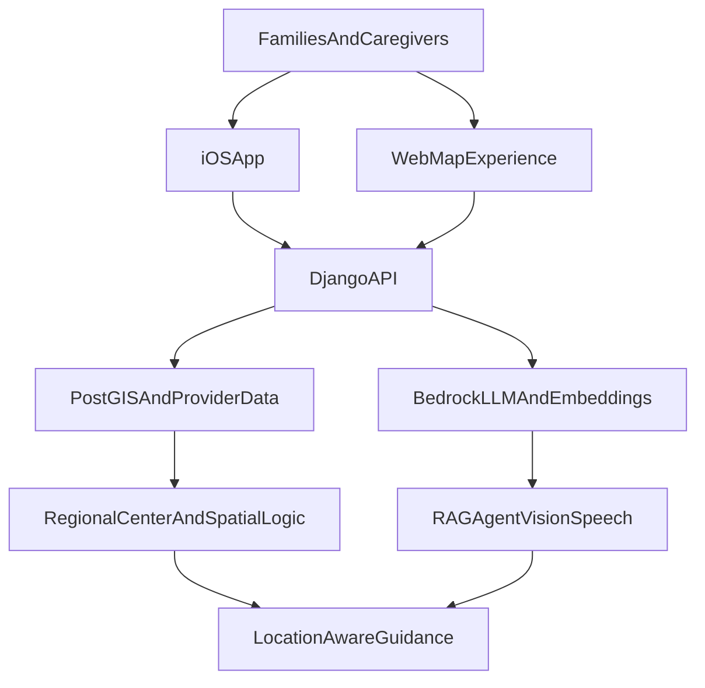

# Platform Strategy Brief

## Purpose
This brief documents the current state and direction of the KiNDD platform with primary emphasis on the GIS/location intelligence layer and the AI/LLM stack. It is written for technical collaborators, institutional partners, and advisors who may want to contribute to or build on this work.

KiNDD is a geospatial care-navigation system for families seeking developmental disability services in Los Angeles County. AI acts as an intelligent interface over trusted location, provider, and eligibility data.

## Executive Summary
KiNDD combines three layers:

- A location-aware data system centered on Los Angeles County Regional Centers, ZIP-to-service-area assignment, provider search, proximity logic, and map-based wayfinding.
- A family-facing application surface on iOS, with parallel web mapping infrastructure.
- An AI layer built on AWS Bedrock that answers questions, streams results in real time, retrieves semantically relevant providers, analyzes uploaded images and documents, and supports bilingual interactions.

The combination of these layers is what matters:

- a regional-center geography model that mirrors the real service system,
- provider access workflows tied to place,
- multilingual navigation for a complex public-health ecosystem,
- and an AI layer that translates complexity into next steps for families.

There are two natural directions for growth:

- Horizontal expansion into new geographies, provider types, languages, and institutional distribution channels.
- Vertical expansion into deeper workflows: intake, eligibility, insurance interpretation, document understanding, longitudinal family guidance, and care coordination.

The near-term priority is to mature KiNDD as a trusted geospatial infrastructure layer for developmental-services navigation while extending the LLM from Q&A toward a grounded workflow engine.

## What Exists Today
The current platform spans four layers.

| Layer                 | Current state                                                         | Strategic role                                                             |
| --------------------- | --------------------------------------------------------------------- | -------------------------------------------------------------------------- |
| Client applications   | iOS app in `chla-ios`, web mapping experience in `map-frontend`       | Family-facing experience and distribution surface                          |
| Application/API layer | Django REST and GraphQL in `maplocation`                              | Orchestration layer for search, spatial logic, and AI APIs                 |
| Geospatial/data layer | PostgreSQL + PostGIS, provider and regional-center models             | Trust layer for service boundaries, proximity, and place-based eligibility |
| AI layer              | AWS Bedrock, Titan embeddings, Claude Sonnet 4.5, Strands agent tools | Conversational access layer over structured and spatial data               |

The iOS app provides the clearest user-facing expression of the product. The home redesign spec in `chla-ios/HOME_PAGE_REDESIGN_SPEC.md` places `Ask KiNDD` at the center while still emphasizing rapid entry into `Near Me`, `Regions`, `Browse`, and `Map`. The platform combines map-based discovery with AI, rather than replacing one with the other.

The App Store submission materials in `chla-ios/APP_STORE_SUBMISSION.md` describe the current public-facing positioning:

- all 7 LA County Regional Centers,
- 370+ verified providers/resources,
- bilingual AI assistance,
- smart search by therapy, insurance, age, and diagnosis,
- and location-based discovery with directions.

## Platform Architecture
The current platform can be summarized as follows:

### Client layer
The iOS app in `chla-ios/CHLA-iOS` is built with SwiftUI and Apple-native services. It includes:

- provider discovery and map views,
- Regional Center list/map experiences,
- in-app chat with streaming AI responses,
- image and document upload flows,
- speech-to-text and text-to-speech,
- and English/Spanish localization.

The web application in `map-frontend` provides a second surface for mapping, search, and directions, using Mapbox GL and related client-side map services.

### API layer
The Django backend in `maplocation` exposes:

- regional-center endpoints,
- provider search endpoints,
- nearby/proximity endpoints,
- LLM endpoints for chat, streaming chat, agent chat, image analysis, and document analysis,
- and supporting health and data services.

This layer is where the most important convergence happens: geographic logic, provider retrieval, and LLM orchestration all meet here.

### Data and GIS layer
The strongest structural asset in the platform is the geospatial model in `maplocation/locations/models.py`.

The backend already stores:

- point geography for `Location`, `RegionalCenter`, and `ProviderV2`,
- `MultiPolygonField` service areas for regional centers,
- JSON ZIP-code assignments for regional-center coverage,
- and spatial indexes and PostGIS-based query paths documented in `maplocation/POSTGIS_DEPLOYMENT.md`.

### AI layer
The AI stack in `maplocation/llm` uses AWS Bedrock for:

- chat and reasoning with Claude Sonnet 4.5,
- embeddings with Titan Embeddings V2,
- streaming responses,
- semantic search with pgvector,
- multimodal image analysis,
- document analysis through text extraction plus LLM reasoning,
- and tool-based agent behavior with Strands.

The AI layer is data-grounded and already structured around a retrieval-augmented architecture rather than unconstrained generation.

## GIS and Location Intelligence Deep Dive
GIS is the foundational layer that makes the product more than a resource directory.

### The core geographic model
The key product concept is documented plainly in `docs/REGIONAL_CENTERS_CONCEPT.md`: the system is fundamentally organized around a geographic flow:

`User Location -> ZIP Code -> Regional Center Assignment -> Providers in that Regional Center`

That is the heart of the product. It matters because developmental-services navigation in California is not purely topical. It is territorial. Eligibility, service areas, provider relevance, and institutional next steps all depend on where a family lives.

The current backend supports this model in several ways:

- `RegionalCenter.find_by_zip_code()` uses ZIP-code assignment logic against JSON ZIP arrays.
- `RegionalCenter` stores both point location and `service_area` polygon data.
- `Location.find_nearest()` and `RegionalCenter.find_nearest()` use PostGIS `dwithin` and distance ordering.
- `RegionalCenterViewSet.service_area_boundaries()` exposes a GeoJSON feature collection containing center metadata, service-area geometry, and ZIP code arrays.

This lets KiNDD answer not just "What services exist?" but "Which services are relevant to this family, in this geography, under this regional system?"

### What is already strong
The GIS layer already has several genuine strengths.

#### 1. A meaningful service-area abstraction
The platform models regional-service responsibility, not just pin placement. That mirrors the real structure of the service ecosystem.

#### 2. PostGIS-backed proximity logic
The move from simple Haversine math to PostGIS-backed point queries, documented in `maplocation/POSTGIS_DEPLOYMENT.md`, improves scale and speed. Spatial indexing supports larger data volumes as the provider database grows.

#### 3. Spatial data exposed as reusable assets
The `service_area_boundaries` endpoint provides data that supports:

- boundary-aware maps,
- regional-center previews,
- credibility in the UI,
- and future service-coverage analysis.

#### 4. Directions and route-based wayfinding
The platform already treats navigation as more than straight-line distance:

- the web stack uses Mapbox Directions in `map-frontend/src/services/mapboxDirections.ts`,
- the iOS app uses `MKDirections` in `chla-ios/CHLA-iOS/Views/DirectionsMapView.swift`.

Driving time, turn-by-turn navigation, and route geometry are directly relevant to families evaluating whether they can realistically access a given provider.

### Current GIS fragmentation
The GIS foundation is real, but it is not fully unified yet.

#### 1. Multiple distance and location strategies coexist
The codebase currently mixes:

- PostGIS distance queries,
- raw SQL Haversine logic,
- and Python-side Haversine loops in some paths.

This shows up across `maplocation/locations/models.py`, `maplocation/locations/views.py`, and `maplocation/locations/schema.py`. The platform has strong geospatial intent but not yet a single canonical geospatial execution model.

#### 2. Regional-center assignment is not yet a single source of truth across clients
The backend has ZIP arrays and service-area polygons. The iOS app also contains a `RegionalCenterMatcher` with baked center coordinates and nearest-center logic. That means the platform currently has two overlapping notions of regional-center resolution:

- backend assignment logic tied to ZIPs and service areas,
- client-side nearest-point heuristics on iOS.

Converging on one authoritative location-assignment engine exposed through APIs would improve consistency across clients.

#### 3. Routing is useful but provider-specific
Directions exist, but routing is currently a surface feature rather than a platform-wide logistics layer. The next strategic step is to treat travel burden as first-class data:

- drive time,
- route difficulty,
- transit accessibility,
- regional-center travel burden,
- and neighborhood service deserts.

That is where GIS moves from a UI enhancement to an infrastructure contribution.

### Why the GIS layer matters
The GIS layer provides:

- consistency: recommendations are tied to real service regions,
- credibility: the map is operational, not decorative,
- extensibility: analytics and partner tooling can be built on a real geospatial substrate.

If the same architecture is extended to new counties or states, it could serve as a reusable model for place-based navigation in fragmented service ecosystems.

### GIS outlook
The strongest GIS opportunities ahead are:

| Horizon     | Opportunity                                                                                 | Why it matters                                             |
| ----------- | ------------------------------------------------------------------------------------------- | ---------------------------------------------------------- |
| Near term   | Unify regional-center assignment across backend and iOS                                     | Improves consistency and trust                             |
| Near term   | Consolidate hot-path search on PostGIS instead of mixed Haversine approaches                | Improves performance and maintainability                   |
| Medium term | Add accessibility, service coverage, and travel-burden metadata                             | Makes maps more clinically and socially meaningful         |
| Medium term | Expand from provider discovery to service-gap intelligence                                  | Supports partnerships, pilots, and institutional analytics |
| Long term   | Reuse the geography engine across new counties, states, and public-interest service systems | Creates a platform rather than a local app                 |

## AI and LLM Deep Dive
The AI layer has a clear architecture and a defined roadmap.

### Current stack
The primary AI implementation lives in:

- `maplocation/llm/bedrock.py`
- `maplocation/llm/query.py`
- `maplocation/llm/views.py`
- `maplocation/llm/agent.py`
- `chla-ios/CHLA-iOS/Services/LLMService.swift`

The current stack includes:

| Capability   | Current implementation                                               |
| ------------ | -------------------------------------------------------------------- |
| Chat model   | Claude Sonnet 4.5 via AWS Bedrock inference profile                  |
| Embeddings   | Titan Embeddings Text V2                                             |
| Retrieval    | pgvector similarity search with keyword fallback                     |
| Streaming UX | SSE endpoints from Django (RAG and agent), consumed in iOS           |
| Tool use     | Strands agent with provider search and eligibility tools             |
| Vision       | Image analysis for insurance cards, documents, and general photos    |
| Documents    | Base64 upload, text extraction from PDF/docx/txt, then LLM reasoning |
| Speech       | On-device Apple Speech for STT, AVSpeechSynthesizer for TTS          |
| Localization | English and Spanish prompts and app language support                 |

### Data-grounded AI
The key architectural decision in the current AI stack is that the model is grounded in platform data rather than unconstrained generation.

The `answer_query()` flow in `maplocation/llm/query.py` does not simply send a user question to a model. It:

1. Resolves regional-center context from ZIP code when available.
2. Enhances the query with diagnosis, insurance, and regional-center context.
3. Retrieves semantically relevant providers from the database using embeddings or keyword fallback.
4. Formats both provider context and user context.
5. Sends that structured context into the model with a domain-specific prompt.

The LLM acts as a reasoning and translation layer over platform data, not as an unconstrained advice engine.

### Prompting strategy
The prompt layer in `maplocation/llm/bedrock.py` is domain-specific and bilingual.

The system prompts encode:

- the California Regional Center system,
- insurance and eligibility context,
- age-based program transitions,
- empathy and clarity expectations,
- and response formatting constraints.

The prompts are tuned for a family-navigation context where tone, next steps, and structural clarity matter as much as factual accuracy.

The same file also contains specialized prompts for:

- insurance-card analysis,
- document analysis,
- and general image interpretation related to developmental-services workflows.

### Multimodal capabilities

#### Image upload
The `ImageAnalysisView` endpoint in `maplocation/llm/views.py` accepts base64-encoded images and supports targeted analysis modes:

- insurance card,
- document,
- general.

Family navigation often depends on semi-structured artifacts:

- insurance cards,
- regional-center letters,
- IEP-related documents,
- referrals,
- and screenshots.

#### Document upload
The `DocumentAnalysisView` path extracts text from PDF, Word, and text documents, then runs LLM reasoning over the extracted text.

#### Speech
Speech is handled locally on device:

- `SpeechRecognizer.swift` uses Apple's Speech framework for STT.
- `TextToSpeech.swift` uses `AVSpeechSynthesizer` for read-aloud.

This avoids the need for cloud audio infrastructure while providing accessibility and usability value.

### Agent path
The Strands agent in `maplocation/llm/agent.py` exposes tools for:

- provider search,
- regional-center lookup,
- provider detail retrieval,
- eligibility guidance,
- therapy-type listing.

This opens the path from "chatbot" to "workflow agent" -- the system can evolve from generating responses to orchestrating user journeys over structured tools and trusted datasets. The agent is now also exposed as a streaming SSE endpoint (`/api/llm/agent-stream/`), matching the production-grade streaming path used by the RAG pipeline.

### AI hardening status
The AI layer has addressed the following areas:

- **Rate limiting:** All LLM endpoints enforce per-IP throttling (`LLMBurstThrottle` at 30/min for chat endpoints, `LLMSensitiveThrottle` at 10/min for image and document upload). This is a first layer of protection while the platform operates with public access during early development.
- **Memory context:** The backend `format_user_context()` in `maplocation/llm/query.py` now consumes the `memory_context` field sent by the iOS app. The personalization loop from client-side `UserMemory` through to the LLM prompt is closed.
- **Conversation history:** Both `AskKiNDDView` and `StreamingAskView` accept and thread `conversation_history` from the client through to the model. Multi-turn continuity is available across the full request surface.
- **Locale parity:** The iOS non-streaming `sendQuery()` path now sends `locale` to the backend, matching the streaming path. Multilingual behavior is enforced consistently.
- **Agent streaming:** A new `StreamingAgentAskView` at `/api/llm/agent-stream/` exposes the Strands agent as a production SSE endpoint with locale support and memory context.
- **Documentation:** `maplocation/BEDROCK_SETUP.md` has been updated to reflect the current model (Claude Sonnet 4.5 inference profiles) and all current endpoints.

Remaining areas for future hardening:

- **Guardrails:** The platform does not yet use Bedrock Guardrails or an equivalent deterministic policy layer. For a healthcare-adjacent product handling sensitive documents, this is the most important next safety investment. AWS Bedrock AgentCore provides a Policy service using Cedar that could serve this role alongside session isolation and observability.
- **Authentication:** Endpoints currently use `AllowAny` with throttling. Moving toward token-based or OAuth authentication is recommended before handling higher-sensitivity data at scale.

### Role of the AI layer
The LLM helps families bridge the gap between complex systems and actionable decisions:

- Which regional center serves me?
- What providers near me match my child's needs?
- What does this insurance card or document mean?
- What should I do next?

It works as a workflow layer over trusted platform data, aligned with real institutional logic rather than unconstrained generation.

## Already Implemented vs Partially Implemented vs Recommended
It is useful to distinguish between what is already live in code, what is partially present, and what remains to be built.

| Status                      | Examples                                                                                                                                                                                                                                                                                                                                                                                                                                          |
| --------------------------- | ------------------------------------------------------------------------------------------------------------------------------------------------------------------------------------------------------------------------------------------------------------------------------------------------------------------------------------------------------------------------------------------------------------------------------------------------- |
| Implemented                 | PostGIS-backed spatial fields, regional-center ZIP logic, GeoJSON service-area endpoint, Mapbox/MapKit directions, Bedrock chat and streaming, pgvector retrieval, image analysis, document analysis, English/Spanish prompt support, iOS STT/TTS, memory-context consumption in backend, end-to-end conversation history threading, locale parity across streaming and non-streaming paths, agent streaming SSE endpoint, rate-limited endpoints |
| Partially implemented       | Unified cross-client regional-center resolution, richer insurance filtering, persistent family profiles                                                                                                                                                                                                                                                                                                                                           |
| Open areas for contribution | Guardrails and policy layer (Bedrock Guardrails or AgentCore Policy), shared geospatial truth across clients, deeper travel/accessibility intelligence, institutional analytics, longitudinal family workflows, privacy and auditability layers                                                                                                                                                                                                   |

## Product Direction: Horizontal and Vertical Expansion
Growth should remain tightly aligned with the platform's core strengths.

### Horizontal expansion
Horizontal expansion means broadening the platform across geography, datasets, modalities, and distribution channels.

#### 1. New geographies
The current architecture is highly LA County specific, especially around the Regional Center system. That specificity is a strength, not a weakness. The right next step is not to dilute that specificity, but to reuse the same pattern:

- place-based service assignment,
- local provider coverage,
- region-specific public systems,
- and map-based navigation.

This can expand first to adjacent California geographies, then to other state-level service systems with similar fragmentation.

#### 2. More provider and service categories
The current stack is strongest around ABA and developmental-disability resources. Horizontal expansion could add:

- developmental pediatricians,
- special education support services,
- family resource centers,
- benefits and legal navigation partners,
- respite and adult transition services,
- and public-agency intake points.

#### 3. More languages and accessibility modes
The bilingual base already exists. The next layer is broader accessibility:

- more languages,
- low-literacy response modes,
- voice-first navigation,
- caregiver-friendly summaries,
- and more explicit accessibility metadata in the GIS layer.

#### 4. More surfaces for distribution
The product currently expresses itself through iOS and web. The same core platform could also support:

- embedded partner widgets,
- referral portals,
- institutional dashboards,
- text-message or voice-assistant workflows,
- and case-manager or navigator tools.

### Vertical expansion
Vertical expansion means becoming more useful within the developmental-disability navigation journey.

#### 1. Eligibility and intake depth
The current system already contains the conceptual pieces for eligibility explanations. The next step is structured guidance around:

- intake preparation,
- regional-center timelines,
- referral flows,
- age transitions,
- and required documents.

#### 2. Insurance and benefits interpretation
The image and document analysis stack opens a major vertical opportunity:

- insurance card interpretation,
- plan-network guidance,
- document summarization,
- benefit explanations,
- and service-authorization workflows.

#### 3. Longitudinal family context
The iOS memory layer shows the product already wants to remember user context. Vertical depth comes from turning that into:

- persistent family profiles,
- reusable intake context,
- milestone-aware reminders,
- history-aware suggestions,
- and continuity across sessions and surfaces.

#### 4. Closed-loop coordination
The most ambitious vertical direction is to move from navigation to coordinated action with partners:

- providers,
- clinics,
- regional centers,
- schools,
- county programs,
- and nonprofit navigators.

This is where the platform could eventually help not only inform families, but reduce real operational friction in the ecosystem.

## Strategic Outlook
The platform can grow into three increasingly powerful forms.

### Phase 1: Geospatial care navigation
This phase is largely underway now.

Core characteristics:

- map-driven provider and regional-center discovery,
- ZIP and service-area intelligence,
- route-aware wayfinding,
- family-friendly UI,
- bilingual support,
- AI as a guided interface over trusted data.

### Phase 2: Workflow intelligence for families
This is the most natural next step.

Core characteristics:

- memory-aware guidance,
- document and insurance interpretation,
- eligibility and intake support,
- stronger multi-turn continuity,
- more grounded model behavior with policy and safety layers.

### Phase 3: Infrastructure for public-interest service access
This is the broader platform vision.

Core characteristics:

- multi-region support,
- institutional analytics,
- service-gap intelligence,
- partner distribution channels,
- and care-system interoperability.

This final phase is what makes the platform interesting not only as a product, but as infrastructure.

## Recommended 90-Day Priorities
The next 90 days should focus on improving product robustness and platform readiness.

### 1. Establish a single source of truth for regional-center assignment
Unify backend and iOS matching so all surfaces resolve service areas through the same logic and APIs.

### 2. Normalize hot-path geospatial execution
Consolidate the most important location and search paths on canonical PostGIS-backed logic where feasible.

### 3. Add a guardrails and policy layer
Integrate Bedrock Guardrails or the AgentCore Policy service (Cedar-based) to enforce deterministic boundaries on model output, especially for endpoints handling insurance cards and clinical documents. This is the most impactful remaining safety investment.

### 4. Clarify the AI product model
The codebase now supports both classic RAG and tool-using agent paths, each with streaming. The next step is deciding which path is primary for the family-facing experience and productizing that choice intentionally.

### 5. Turn GIS from a search feature into an insight layer
Start adding the next class of spatial value:

- drive-time relevance,
- underserved-area detection,
- service-access burden,
- and map-based institutional reporting.

## Collaboration and Sustainability
The technology direction maps onto several themes where institutional, academic, and philanthropic partners tend to have active interest.

### Relevant themes
- Health equity and bilingual care access
- Developmental-disability navigation and family support
- Public-interest GIS and service-access transparency
- Responsible AI for administrative burden reduction
- Child health and care-coordination infrastructure

### Potential collaboration pathways
- Philanthropic grants focused on child health, disability equity, or family support
- Hospital innovation or community-benefit programs
- Public-sector pilots with county or regional service agencies
- University or research collaborations around care access, AI, and health equity
- Institutional partners with infrastructure or data that would complement the platform

### Who would benefit from contributing
Five groups are most naturally aligned:

- **Pediatric and developmental-health partners** who understand clinical and referral workflows
- **Regional-center or public-agency partners** who understand service geography and intake pain points
- **GIS and data partners** who can help expand service-area intelligence and coverage analytics
- **Responsible-AI and privacy advisors** who can harden the model layer for sensitive use cases
- **Product and design collaborators** who can translate complexity into high-trust family experiences

### What partners get
A partner contributing to KiNDD would work with:

- a real, code-complete geospatial infrastructure for navigating fragmented developmental-services systems,
- an AI stack that is grounded in institutional data and already handles bilingual queries, image and document analysis, and tool-based agent workflows,
- and a platform architecture designed to be extended to new geographies and service domains.

The project is strongest when framed as shared infrastructure for care navigation, not as a standalone consumer app.

## Conclusion
KiNDD combines a region-specific geospatial model, a care-navigation product surface, and an LLM stack grounded in real provider and regional-center data.

The next stage of work should deepen the platform where its architecture is already strongest:

- place-based service navigation,
- trusted workflow support,
- bilingual family guidance,
- and data-grounded AI.

Unifying the remaining cross-client seams and adding a guardrails layer will move the platform from a working application toward reusable public-interest infrastructure for developmental-services navigation.

## Key Source Anchors
- `chla-ios/README.md`
- `chla-ios/HOME_PAGE_REDESIGN_SPEC.md`
- `chla-ios/APP_STORE_SUBMISSION.md`
- `docs/REGIONAL_CENTERS_CONCEPT.md`
- `maplocation/POSTGIS_DEPLOYMENT.md`
- `maplocation/locations/models.py`
- `maplocation/locations/views.py`
- `maplocation/llm/bedrock.py`
- `maplocation/llm/query.py`
- `maplocation/llm/views.py`
- `maplocation/llm/agent.py`
- `map-frontend/src/services/mapboxDirections.ts`
- `chla-ios/CHLA-iOS/Services/LLMService.swift`
- `chla-ios/CHLA-iOS/Services/UserMemory.swift`
- `chla-ios/CHLA-iOS/Services/SpeechRecognizer.swift`
- `chla-ios/CHLA-iOS/Services/TextToSpeech.swift`
- `chla-ios/CHLA-iOS/Views/DirectionsMapView.swift`
